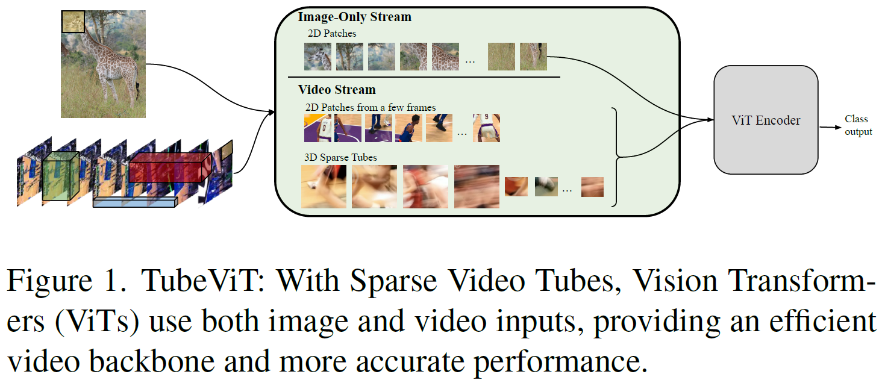
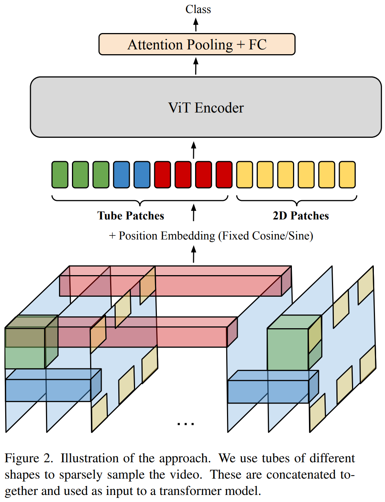
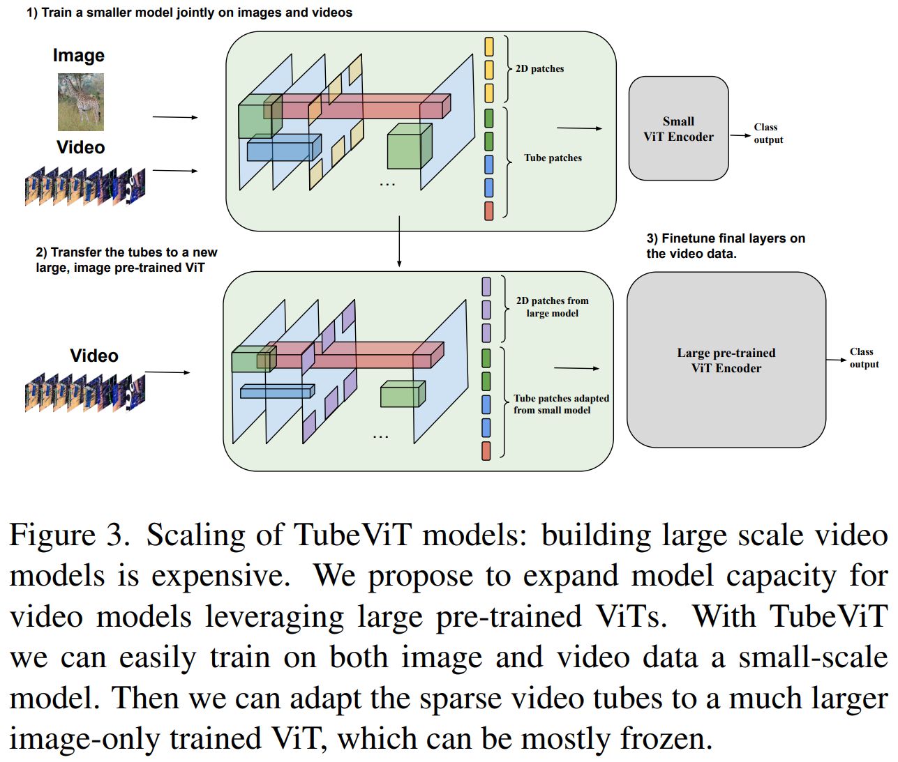
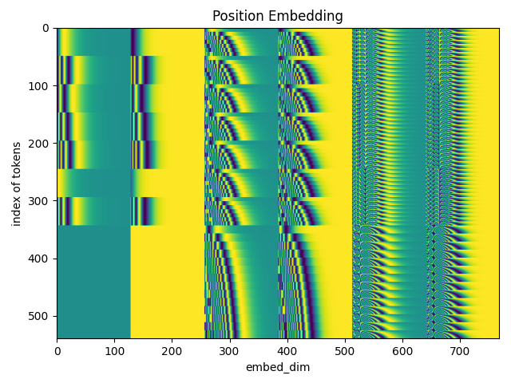

# TubeViT

An unofficial implementation of TubeViT
in "[Rethinking Video ViTs: Sparse Video Tubes for Joint Image and Video Learning](https://arxiv.org/abs/2212.03229)"

# Spec.

- [x] Fixed Positional embedding
- [ ] Sparse Tube Construction
    - [x] Multi-Tube
    - [x] Interpolated Kernels
    - [ ] Space To Depth
    - [ ] config of tubes
- [ ] pipeline
    - [x] training
    - [x] evaluating
    - [ ] inference

# Usage

This project is based on `torch==1.13.1` and [pytorch-lightning](https://github.com/Lightning-AI/lightning)

## Setup

1. Install requirements

    ```commandline
    pip install -r requirements.txt
    ```

2. Download UFC101 dataset

## Convert ViT pre-trained weight

Use `convert_vit_weight.py` to convert torch ViT pre-trained weight to TubeVit.

```commandline
python scripts/convert_vit_weight.py --help                                                                              ✔ 
Usage: convert_vit_weight.py [OPTIONS]

Options:
  -nc, --num-classes INTEGER      num of classes of dataset.
  -f, --frames-per-clip INTEGER   frame per clip.
  -v, --video-size <INTEGER INTEGER>...
                                  frame per clip.
  -o, --output-path PATH          output model weight name.
  --help                          Show this message and exit.
```

### Example

Convert ImageNet pre-trained weight to UCF101. `--num-classes` is 101 by default.

```commandline
python scripts/convert_vit_weight.py
```

## Train

Current `train.py` only train on pytorch UCF101 dataset.
Change the dataset if needed.

`--dataset-root` and `--annotation-path` is based
on [torchvision.datasets.UCF101](https://pytorch.org/vision/main/generated/torchvision.datasets.UCF101.html)

```commandline
python scripts/train.py --help

Usage: train.py [OPTIONS]

Options:
  -r, --dataset-root PATH         path to dataset.  [required]
  -a, --annotation-path PATH      path to dataset.  [required]
  -nc, --num-classes INTEGER      num of classes of dataset.
  -b, --batch-size INTEGER        batch size.
  -f, --frames-per-clip INTEGER   frame per clip.
  -v, --video-size <INTEGER INTEGER>...
                                  frame per clip.
  --max-epochs INTEGER            max epochs.
  --num-workers INTEGER
  --fast-dev-run
  --seed INTEGER                  random seed.
  --preview-video                 Show input video
  --help                          Show this message and exit.
```

### Examples

```commandline
python scripts/train.py -r path/to/dataset -a path/to/annotation
```

## Evaluation

```commandline
python scripts/evaluate.py --help

Usage: evaluate.py [OPTIONS]

Options:
  -r, --dataset-root PATH         path to dataset.  [required]
  -m, --model-path PATH           path to model weight.  [required]
  -a, --annotation-path PATH      path to dataset.  [required]
  --label-path PATH               path to classInd.txt.  [required]
  -nc, --num-classes INTEGER      num of classes of dataset.
  -b, --batch-size INTEGER        batch size.
  -f, --frames-per-clip INTEGER   frame per clip.
  -v, --video-size <INTEGER INTEGER>...
                                  frame per clip.
  --num-workers INTEGER
  --seed INTEGER                  random seed.
  --verbose                       Show input video
  --help                          Show this message and exit.
```

### Examples

```commandline
python scripts/evaluate.py -r path/to/dataset -a path/to/annotation
```

# Model Architecture





# Positional embedding



