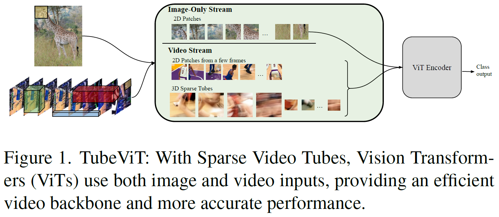
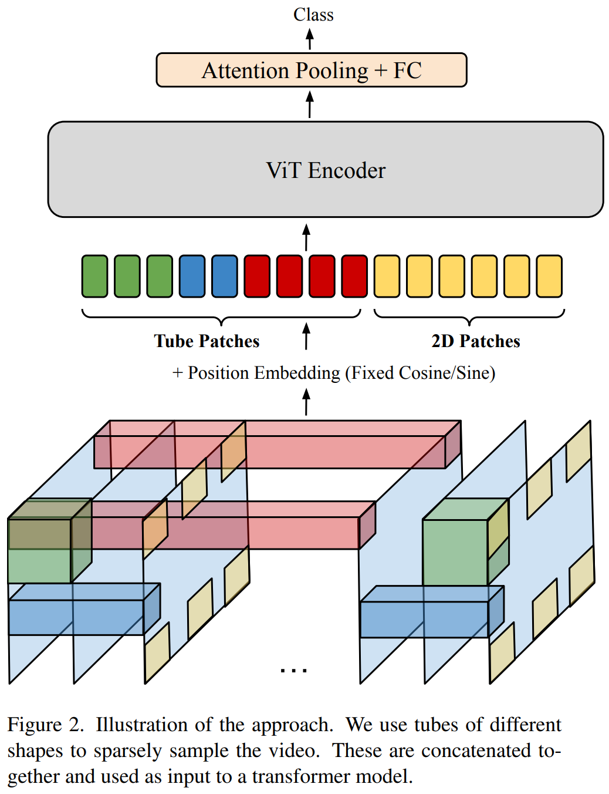
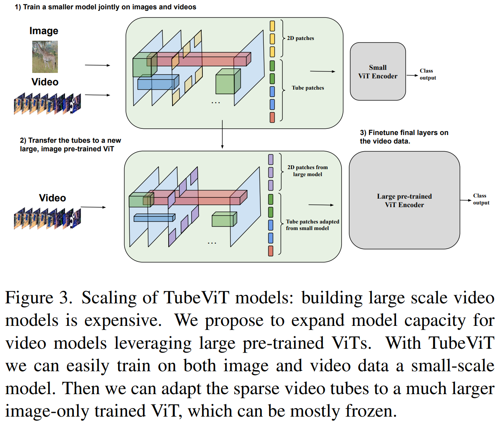
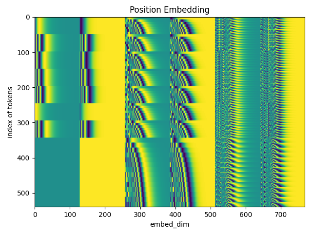

# TubeViT

An unofficial PyTorch implementation of TubeViT
from ["Rethinking Video ViTs: Sparse Video Tubes for Joint Image and Video Learning"](https://arxiv.org/abs/2212.03229).

## Status

- [x] Fixed 3D sincos positional embedding (computed in physical input-video coordinates)
- [x] Sparse tube construction
    - [x] Multi-tube (4 hard-coded configs: `kernel_sizes`, `strides`, `offsets` in `tubevit/model.py`)
    - [x] Interpolated kernels (a single learnable 3D conv weight is trilinear-resized per tube at every forward pass)
    - [x] Space-to-depth (configurable temporal and spatial folding factors per tube)
    - [ ] Configurable tubes
- [x] Pipeline
    - [x] Training (video-only and joint image+video)
    - [x] Evaluation
    - [x] Inference

## Requirements

- Python ≥ 3.12
- [`uv`](https://docs.astral.sh/uv/) for dependency management
- A CUDA-capable GPU is recommended

Built on `torch ≥ 2.11`, `lightning ≥ 2.6` (PyTorch Lightning 2.x), `torchvision`, `torchmetrics`, `tensorboard`, and
`click`. The full dependency graph is pinned in `uv.lock`.

## Setup

```bash
uv sync
```

## Usage

Every entry point is a [click](https://click.palletsprojects.com/) CLI under `scripts/` — run any of them with `--help`
to see all options.

### 1. Dataset

Download UCF101 and its annotation split. Paths follow the layout expected by [
`torchvision.datasets.UCF101`](https://pytorch.org/vision/main/generated/torchvision.datasets.UCF101.html).

### 2. Convert a ViT-B/16 checkpoint to TubeViT

Inflates `torchvision.ViT_B_16_Weights.DEFAULT` into a TubeViT-compatible weight file. The 2D patch-embedding kernel is
bilinearly resized to 8×8, a temporal dim is unsqueezed and repeated 8× (then divided by 8) to seed the tokenizer's 3D
conv.

```bash
python scripts/convert_vit_weight.py
# -> tubevit_b_(a+iv)+(d+v)+(e+iv)+(f+v).pt
```

`scripts/train.py` expects exactly this filename at the repo root.

### 3. Train

**Video-only (UCF-101):**

```bash
python scripts/train.py \
    -r path/to/ucf101 \
    -a path/to/ucfTrainTestlist
```

**Joint image + video** (paper §3.5 — separate heads per domain, shared encoder):

```bash
python scripts/train.py \
    -r path/to/ucf101 \
    -a path/to/ucfTrainTestlist \
    --image-dataset-path path/to/imagenette2-320 \
    --image-num-classes 10
```

`--image-dataset-path` expects a directory with `train/` and `val/` sub-folders in ImageFolder layout
(e.g. Imagenette2-320). When provided, the model trains two classification heads — one for video, one for
image — and logs `train_loss` / `train_img_loss` (and corresponding `_acc`, `_f1`) to TensorBoard separately.

**Common options:**

| Flag | Default | Description |
|------|---------|-------------|
| `-b` / `--batch-size` | 32 | Batch size |
| `-f` / `--frames-per-clip` | 32 | Frames sampled per UCF-101 clip |
| `--max-epochs` | 10 | Training epochs |
| `--lr` | 1e-4 | Learning rate (paper: 5e-5 for ViT-B) |
| `--weight-decay` | 0.001 | Adam weight decay |
| `--warmup-steps` | 0 | Linear LR warmup steps (paper: 10000) |
| `--interpolated-kernels` | off | Ablation: share one 3D conv kernel across all tubes |
| `--fast-dev-run` | off | One-batch sanity check |

- TensorBoard logs: `logs/TubeViT/`
- Checkpoint saved to: `./models/tubevit_ucf101.ckpt`
- UCF-101 clip metadata is cached to `ucf101-{train,val}-meta.pickle` at the repo root on first run. Delete to
  invalidate.

### 4. Evaluate

```bash
python scripts/evaluate.py \
    -r path/to/ucf101 \
    -a path/to/ucfTrainTestlist \
    --label-path path/to/classInd.txt \
    -m path/to/checkpoint.ckpt
```

Prints accuracy / top-5 / AUROC / F1, and writes a confusion-matrix heatmap to `output.png`.

### 5. Inference on a single video

```bash
python scripts/infernce.py path/to/video.mp4 \
    --label-path path/to/classInd.txt \
    -m path/to/checkpoint.ckpt
```

## Model architecture





## Positional embedding



## License

MIT — see [LICENSE](LICENSE).
